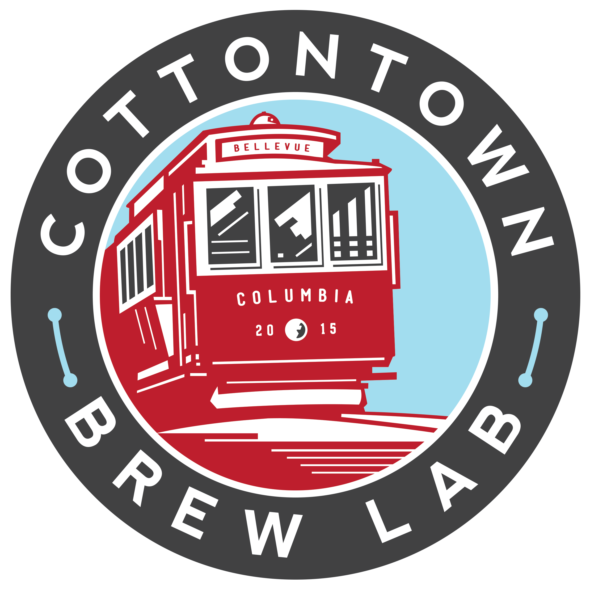

### PSBO - Columbia's Annual Homebrewers Competition

PSBO (Palmetto State Brewer's association Open) is Columbia, SC's annual homebrewers competition.
Each year entries from around the Southeast are delivered to Columbia, and the best judges around
provide their feedback to those who love the art.

### Fundraising

For each competition we elect a local non-profit to support. All proceeds from the raffle go to this
organization. It is our club's goal to forward the hobby and passion of beer and to support our community.

**Supported Organization For 2019**:

[Homeward Bound Pet Rescue](https://www.homewardboundrescuesc.com/)

 

## Thanks to Our Great Sponsors

[Cotton Town Brew Lab](https://ctbl.azurewebsites.net/)

